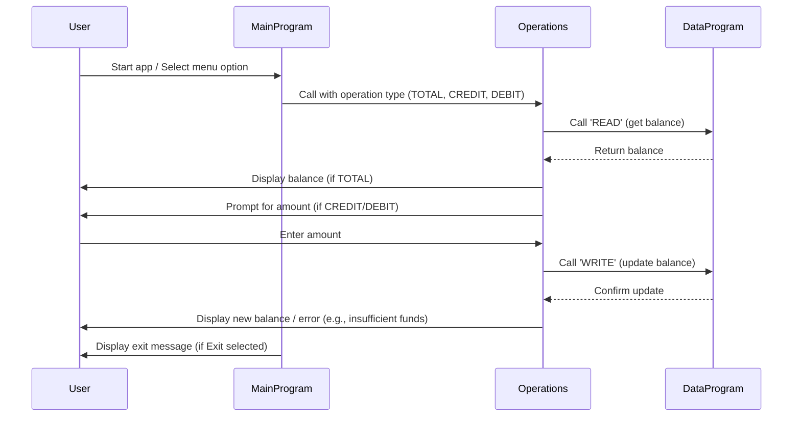

---

## Sequence Diagram: Data Flow

```mermaid
sequenceDiagram
    participant User
    participant MainProgram
    participant Operations
    participant DataProgram

    User->>MainProgram: Start app / Select menu option
    MainProgram->>Operations: Call with operation type (TOTAL, CREDIT, DEBIT)
    Operations->>DataProgram: Call 'READ' (get balance)
    DataProgram-->>Operations: Return balance
    Operations->>User: Display balance (if TOTAL)
    Operations->>User: Prompt for amount (if CREDIT/DEBIT)
    User->>Operations: Enter amount
    Operations->>DataProgram: Call 'WRITE' (update balance)
    DataProgram-->>Operations: Confirm update
    Operations->>User: Display new balance / error (e.g., insufficient funds)
    MainProgram->>User: Display exit message (if Exit selected)
```
