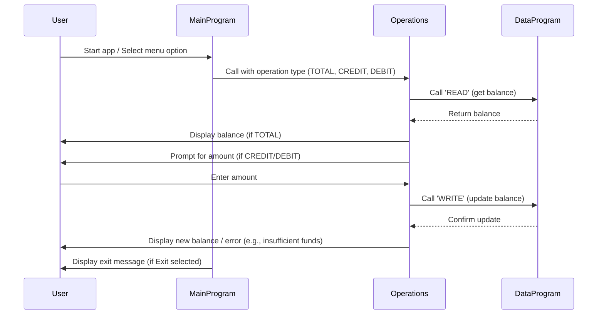

# COBOL Student Account Management System Documentation

## Overview
This project implements a simple student account management system using COBOL. The system allows users to view their account balance, credit (add funds), and debit (withdraw funds) from their account. The business rules ensure proper handling of account operations, including preventing overdrafts.

## File Structure

### src/cobol/main.cob
**Purpose:**
- Entry point for the application.
- Presents a menu to the user for account operations.
- Handles user input and delegates actions to the Operations module.

**Key Functions:**
- Displays menu options: View Balance, Credit Account, Debit Account, Exit.
- Accepts user choice and calls the Operations program with the selected operation.

**Business Rules:**
- Only allows valid choices (1-4).
- Exits gracefully when the user selects Exit.

---

### src/cobol/operations.cob
**Purpose:**
- Implements the logic for account operations: viewing balance, crediting, and debiting.
- Interacts with the DataProgram module to read/write account balance.

**Key Functions:**
- Handles three operations: 'TOTAL ' (view balance), 'CREDIT' (add funds), 'DEBIT ' (withdraw funds).
- For credit/debit, prompts user for amount and updates balance accordingly.
- Prevents debit if funds are insufficient.

**Business Rules:**
- Ensures that debit operations do not exceed available balance.
- Updates balance after each credit/debit operation.

---

### src/cobol/data.cob
**Purpose:**
- Manages persistent storage of the account balance.
- Provides read and write operations for the balance.

**Key Functions:**
- 'READ': Returns the current balance to the caller.
- 'WRITE': Updates the stored balance with the new value.

**Business Rules:**
- Initializes balance to 1000.00 by default.
- Only updates balance when a valid write operation is requested.

---

## Business Rules Summary
- Student accounts start with a default balance of 1000.00.
- Debit operations are only allowed if sufficient funds are available.
- Credit operations add the specified amount to the balance.
- Balance is updated and persisted after each operation.

---

## Usage
Run the main COBOL program to start the account management system. Follow the menu prompts to perform account operations.

---

## Authors
- ArunGN-Acc

---

## License
See LICENSE for details.

---

## Sequence Diagram: Data Flow

